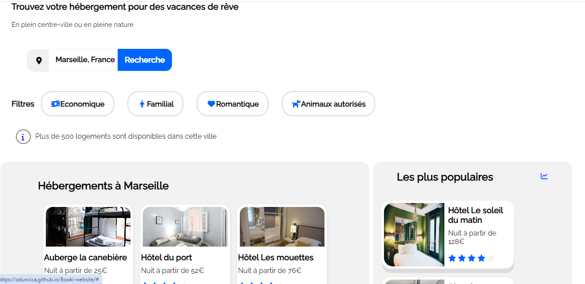
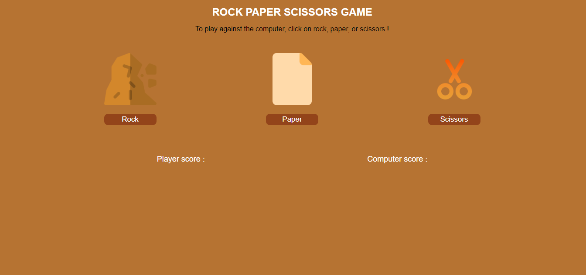
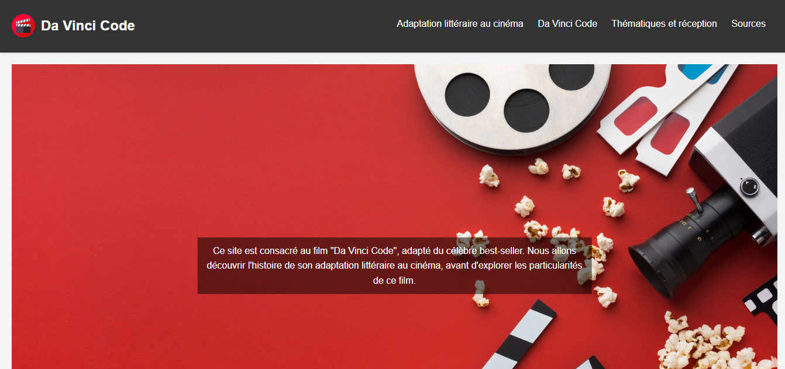
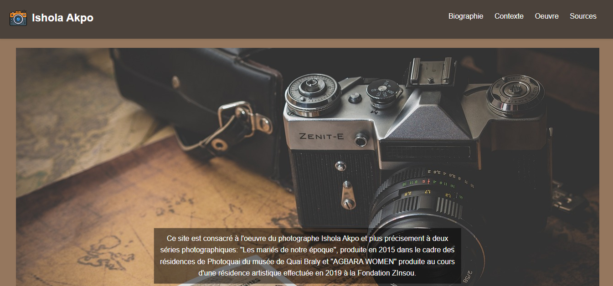

<h2 align="center">Hello, <a href="https://github.com/oduncica" 
  title="Profile">I'm Charlene</a>👋</h2>
 

  I'm a 23-year-old Front-end Developer in Paris, adept at creating captivating web experiences.   
Skilled in front-end frameworks, I thrive on solving code challenges. Passionate about innovation, I stay abreast of industry trends.   
Beyond coding, I explore design trends and contribute to open-source projects. Eager to make a difference through creativity and technical prowess.
  
  
  📫 How to reach me:

  
  

 

<h1 align="center">🚀 Languages & Tools</h1>

<h3 align='center'>🏝️ Front End</h3>

<table align="center">
  <tr>
    <td align="center" height="70" width="70">
      
       HTML5
    </td>
    <td align="center" height="70" width="70">
      
       CSS3
    </td>
    <td align="center" height="70" width="70">
      
       JavaScript
    </td>
 
  
  
  </tr>

  <tr>
  <td align="center" height="70" width="70">
      
       Tailwind Css
    </td>
   <td align="center" height="70" width="70">
      
       Vue.js
    </td>
   <td align="center" height="70" width="70">
      
       React
    </td>
  </tr>
</table>

<h3 align='center'>👷🏻 Back End</h3>

<table align="center">
  <tr>
    <td align="center" height="70" width="70">
      
       Php
    </td>
    <td align="center" height="70" width="70">
      
       SQL
    </td>
    <td align="center" height="70" width="70">
      
       Node js
    </td>
  </tr>
</table>

<h3 align='center'>⚗️ Tools</h3>

<table align="center">
  <tr>
    <td align="center" height="70" width="70">
      
       Git
    </td>
  
  <td align="center" height="70" width="70">
      
       Figma

  </td>
      <td align="center" height="70" width="70">
      
       Vite
    </td>
  </tr>
</table>

 

<h1 align="center">Projects</h1>

<h2 align="center">Newest Projects First</h2>

<table>
  <tr>
    <td width='50%'>
      <h2 align='center'>Library App</h2>
      
  
        
         
         
        

          
          
        

        
<strong>Html, Css, Javascript</strong>

      

    </td>
  </tr>
  <tr>
    <td width='50%'>
    <h2 align='center'>Booki Website</h2>
      
  
        
         
         
        

          
          
        

        
<strong>Html, CSS</strong>

      
</td>
    <td width='50%'>
      <h2 align='center'>Rock Paper Scissor</h2>
      
  
        
         
         
        

          
          
        

        
<strong>HTML, CSS, JavaScript</strong>

      

    </td>
  </tr>
  <tr>
    <td width='50%'>
      <h2 align='center'>Cinema Website</h2>
      
  
        
         
         
        

          
          
        

        
<strong>HTML, CSS</strong>

      

    </td>
    <td width='50%'>
      <h2 align="center">Photo Website</h2>
      
  
        
         
         
        

          
          
        

        
<strong>HTML, CSS</strong>

      

    </td>
  </tr>
</table>
