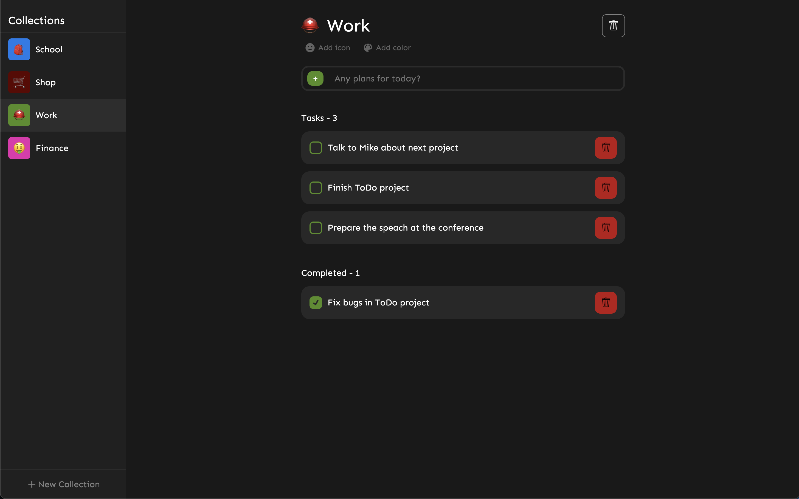
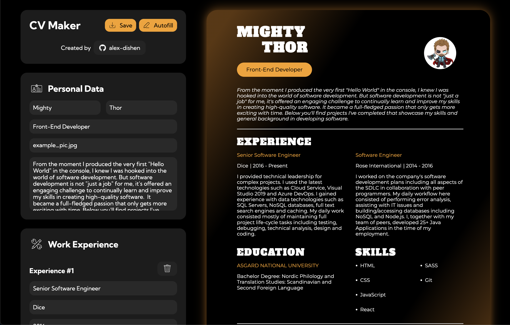
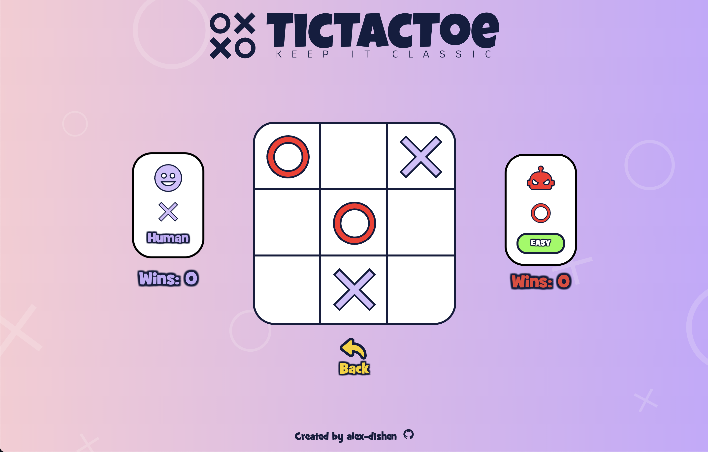
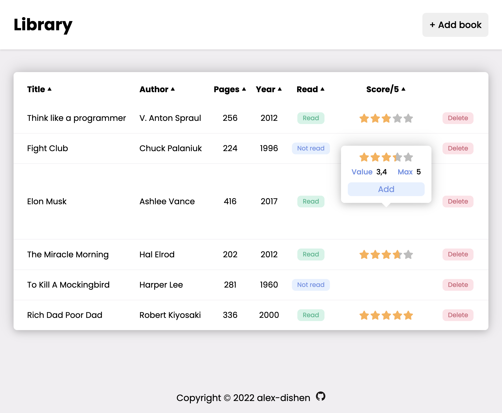
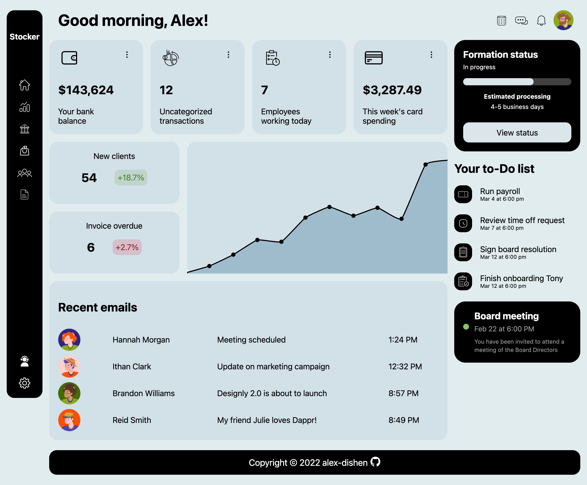
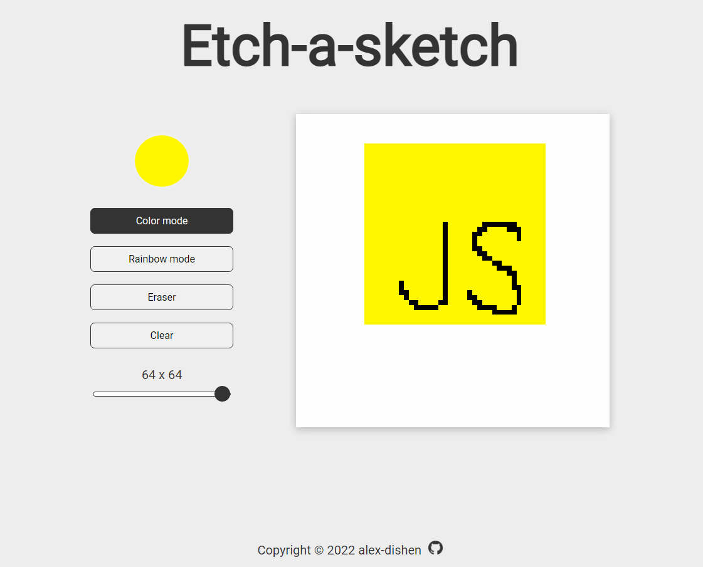
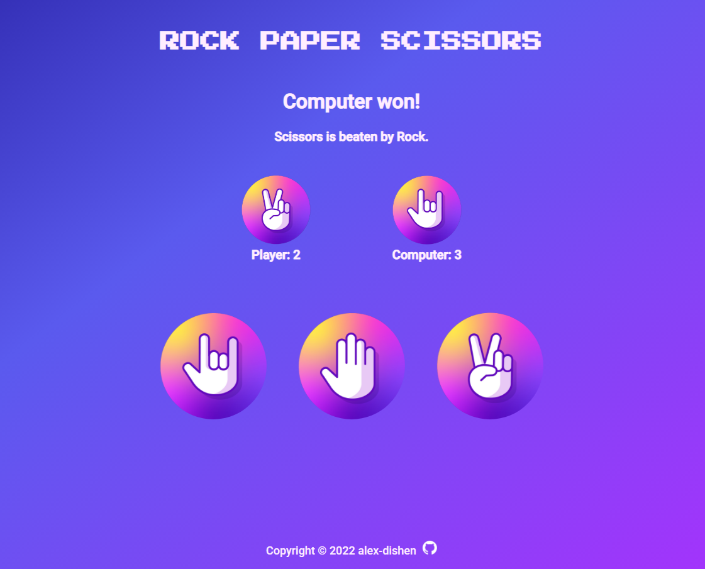

<h2 align="center">Hello, <a href="https://github.com/oduncica" 
  title="Profile">I'm Charlene</a>👋</h2>
 

  I'm a 23 years old Software Engineer based in Paris. 
  I enjoy being given challenging, visually-pleasing designs and making them a reality.  
  The thing that excites me, and gets me pumped up  
  is the process of tearing an idea down into its smallest components,   
  learning, and figuring out how to put those pieces together 
  while creating something really awesome.
  
  
  📫 How to reach me:

  
  

 

<h1 align="center">🚀 Languages & Tools</h1>

<h3 align='center'>🏝️ Front End</h3>

<table align="center">
  <tr>
    <td align="center" height="70" width="70">
      
       HTML5
    </td>
    <td align="center" height="70" width="70">
      
       CSS3
    </td>
    <td align="center" height="70" width="70">
      
       JavaScript
    </td>
    <td align="center" height="70" width="70">
      
       Typescript
    </td>
  
  
  
  </tr>

  <tr>
  <td align="center" height="70" width="70">
      
       Tailwind Css
    </td>
   <td align="center" height="70" width="70">
      
       Vue.js
    </td>
   <td align="center" height="70" width="70">
      
       React
    </td>
    <td align="center" height="70" width="70">
      
       React Native
    </td>
  </tr>
</table>

<h3 align='center'>👷🏻 Back End</h3>

<table align="center">
  <tr>
    <td align="center" height="70" width="70">
      
       Php
    </td>
    <td align="center" height="70" width="70">
      
       SQL
    </td>
    <td align="center" height="70" width="70">
      
       Node js
    </td>
  </tr>
</table>

<h3 align='center'>⚗️ Tools</h3>

<table align="center">
  <tr>
    <td align="center" height="70" width="70">
      
       Git
    </td>
  
  <td align="center" height="70" width="70">
      
       Figma

  </td>
      <td align="center" height="70" width="70">
      
       Vite
    </td>
  </tr>
</table>

 

<h1 align="center">Projects</h1>

<h2 align="center">Newest Projects First</h2>

<table>
  <tr>
    <td width='50%'>
      <h2 align='center'>To-Do</h2>
      
  
        
         
         
        

          
          
        

        
<strong>React, Redux, Styled-Components</strong>

      

    </td>
    <td width='50%'>
      <h2 align='center'>Memory Card</h2>
      
  
        
         
         
        

          
          
        

        
<strong>React, SCSS</strong>

      

    </td>
  </tr>
  <tr>
    <td width='50%'>
    <h2 align='center'>CV Maker</h2>
      
  
        
         
         
        

          
          
        

        
<strong>React, SCSS</strong>

      
</td>
    <td width='50%'>
      <h2 align='center'>Tic Tac Toe</h2>
      
  
        
         
         
        

          
          
        

        
<strong>HTML, CSS, JavaScript</strong>

      

    </td>
  </tr>
  <tr>
    <td width='50%'>
      <h2 align='center'>Library</h2>
      
  
        
         
         
        

          
          
        

        
<strong>HTML, CSS, JavaScript</strong>

      

    </td>
    <td width='50%'>
      <h2 align="center">Admin Dashboard</h2>
      
  
        
         
         
        

          
          
        

        
<strong>HTML, CSS</strong>

      

    </td>
  </tr>

  <tr>
    <td width='50%'>
      <h2 align="center">Etch-a-Sketch</h2>
      
  
        
         
         
        

          
          
        

        
<strong>HTML, CSS, JavaScript</strong>

      

    </td>
    <td width='50%'>
      <h2 align="center">Rock Paper Scissors</h2>
      
  
        
         
         
        

          
          
        

        
<strong>HTML, CSS, JavaScript</strong>

      

    </td>
  </tr>
</table>
