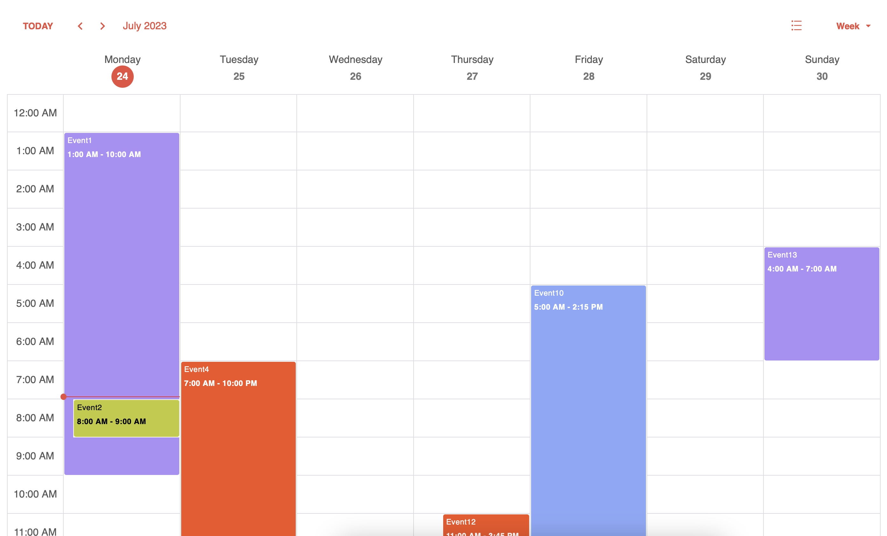
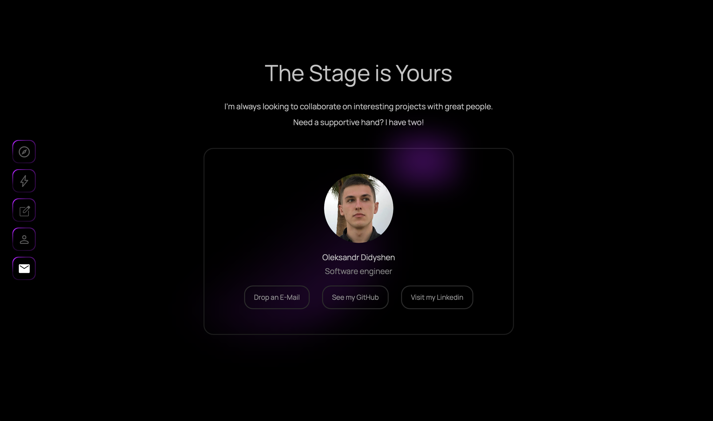

<h2 align="center">Hello, <a href="https://github.com/oduncica" 
  title="Profile">I'm Charlene</a>👋</h2>
 

  I'm a 23 years old Software Engineer based in Paris. 
  I enjoy being given challenging, visually-pleasing designs and making them a reality.  
  The thing that excites me, and gets me pumped up  
  is the process of tearing an idea down into its smallest components,   
  learning, and figuring out how to put those pieces together 
  while creating something really awesome.
  
  
  📫 How to reach me:

  
  

 

<h1 align="center">🚀 Languages & Tools</h1>

<h3 align='center'>🏝️ Front End</h3>

<table align="center">
  <tr>
    <td align="center" height="70" width="70">
      
       HTML5
    </td>
    <td align="center" height="70" width="70">
      
       CSS3
    </td>
    <td align="center" height="70" width="70">
      
       JavaScript
    </td>
    <td align="center" height="70" width="70">
      
       TypeScript
    </td>
    <td align="center" height="70" width="70">
      
       React
    </td>
  </tr>
  <tr>
    <td align="center" height="70" width="70">
      
       Next.js
    </td>
    <td align="center" height="70" width="70">
      
       React Native
    </td>
    <td align="center" height="70" width="70">
      
       Redux
    </td>
    <td align="center" height="70" width="70">
      
       Styled Components
    </td>
    <td align="center" height="70" width="70">
      
       SASS
    </td>
  </tr>
</table>

<h3 align='center'>👷🏻 Back End</h3>

<table align="center">
  <tr>
    <td align="center" height="70" width="70">
      
       Nest.js
    </td>
    <td align="center" height="70" width="70">
      
       Prisma
    </td>
    <td align="center" height="70" width="70">
      
       PostgreSQL
    </td>
  </tr>
</table>

<h3 align='center'>⚗️ Tools</h3>

<table align="center">
  <tr>
    <td align="center" height="70" width="70">
      
       Git
    </td>
    <td align="center" height="70" width="70">
      
       Vite
    </td>
    <td align="center" height="70" width="70">
      
       AWS
    </td>
    <td align="center" height="70" width="70">
      
       Figma
    </td>
  </tr>
</table>

 

<h1 align="center">Projects</h1>

<h2 align="center">Newest Projects First</h2>

<table>
  <tr>
    <!-- <td width='50%'></td> -->
     <td width='50%' colspan=2>
      <h2 align='center'>Game Harbor</h2>
      
  
        
         
         
        

          
          
          
        

        
<strong>React, TypeScript, Redux, NestJs, Prisma, PostgreSQL</strong>

      

    </td>
  </tr>
  <tr>
    <td width='50%'>
      <h2 align='center'>Chronous Landing</h2>
      
  
        
         
         
        

          
        

        
<strong>React, TypeScript, Next.js, Styled-Components</strong>

      

    </td>
    <td width='50%'>
      <h2 align='center'>Chronous</h2>
      
  
        
         
         
        

          
          
        

        
<strong>React, TypeScript</strong>

      

    </td>
  </tr>
    <td width='50%'>
      <h2 align='center'>Swipi Landing</h2>
      
  
        
         
         
        
        
<strong>React, TypeScript, Next.js, Chakra</strong>

      

    </td>
    <td width='50%'>
      <h2 align='center'>Portfolio</h2>
      
  
        
         
         
        

          
          
        

        
<strong>React, Next.js, TypeScript, Styled-Components</strong>

      

    </td>
  </tr>
  <tr>

  </tr>
  <tr>
    <td width='50%'>
      <h2 align='center'>To-Do</h2>
      
  
        
         
         
        

          
          
        

        
<strong>React, Redux, Styled-Components</strong>

      

    </td>
    <td width='50%'>
      <h2 align='center'>Memory Card</h2>
      
  
        
         
         
        

          
          
        

        
<strong>React, SCSS</strong>

      

    </td>
  </tr>
  <tr>
    <td width='50%'>
    <h2 align='center'>CV Maker</h2>
      
  
        
         
         
        

          
          
        

        
<strong>React, SCSS</strong>

      
</td>
    <td width='50%'>
      <h2 align='center'>Tic Tac Toe</h2>
      
  
        
         
         
        

          
          
        

        
<strong>HTML, CSS, JavaScript</strong>

      

    </td>
  </tr>
  <tr>
    <td width='50%'>
      <h2 align='center'>Library</h2>
      
  
        
         
         
        

          
          
        

        
<strong>HTML, CSS, JavaScript</strong>

      

    </td>
    <td width='50%'>
      <h2 align="center">Admin Dashboard</h2>
      
  
        
         
         
        

          
          
        

        
<strong>HTML, CSS</strong>

      

    </td>
  </tr>
  <tr>
    <td width='50%'>
      <h2 align="center">Calculator</h2>
      
  
        
         
         
        

          
          
        

        
<strong>HTML, CSS, JavaScript</strong>

      

    </td>
  </tr>
  <tr>
    <td width='50%'>
      <h2 align="center">Etch-a-Sketch</h2>
      
  
        
         
         
        

          
          
        

        
<strong>HTML, CSS, JavaScript</strong>

      

    </td>
    <td width='50%'>
      <h2 align="center">Rock Paper Scissors</h2>
      
  
        
         
         
        

          
          
        

        
<strong>HTML, CSS, JavaScript</strong>

      

    </td>
  </tr>
  <tr>
    <td width='50%'>
      <h2 align="center">Landing page</h2>
      
  
        
         
         
        

          
          
        

        
<strong>HTML, CSS</strong>

      

    </td>
  </tr>
</table>
